# SVF-PropDbReader

<p align="center">
  
</p>

[](https://www.nuget.org/packages/SVF.PropDbReader)
[](https://www.nuget.org/packages/SVF.PropDbReader)
[](https://dotnet.microsoft.com/en-us/download/dotnet/8.0)
[](LICENSE.txt)

---

## Table of Contents

- [Overview](#overview)
- [Architecture](#architecture)
- [Installation](#installation)
- [Quick Start](#quick-start)
- [Full API Reference](#full-api-reference)
  - [PropDbReader Class](#propdbReader-class)
  - [DbDownloader Class](#dbdownloader-class)
  - [ManifestHelper Class](#manifesthelper-class)
- [Usage Examples (All Methods)](#usage-examples-all-methods)
- [Advanced Scenarios](#advanced-scenarios)
- [How to Update the Package](#how-to-update-the-package)
- [Models & Data Types](#models--data-types)
- [Performance & Best Practices](#performance--best-practices)
- [Dependencies](#dependencies)
- [Contributing](#contributing)
- [License](#license)
- [References](#references)

---

## Overview

**SVF-PropDbReader** is a .NET 8.0 library for reading and extracting property database (PropDb) information from SVF (Simple Vector Format) files. SVF is the proprietary 3D model format used by **Autodesk Platform Services (APS)** (formerly Forge) to stream 3D models in web applications.

The PropDb is a SQLite database (`.sdb` file) embedded in every translated SVF model — it contains **all metadata and properties** for every element in the model (name, category, dimensions, materials, custom parameters, etc.).

This library enables you to:

- **Read properties** from a local `.sdb` file or download them directly from APS using an access token and model URN.
- **Discover** all categories and property names in a model.
- **Query, filter, and stream** property values efficiently across large models.
- **Merge inherited properties** from parent elements.
- **Execute custom SQL** directly against the property database.

### Use Cases


---

## Architecture

### Class Diagram


### Database Schema (EAV Model)

The property database uses an **Entity-Attribute-Value (EAV)** schema:


**Key concept:** The `dbId` is the numeric identifier for every element in the model. It corresponds to the same dbId used in the APS Viewer JavaScript API.

### Data Flow — Downloading from APS


---

## Installation

### Using .NET CLI

```shell
dotnet add package SVF.PropDbReader
```

### Using Package Manager Console

```powershell
Install-Package SVF.PropDbReader
```

### Using PackageReference (in `.csproj`)

```xml
<PackageReference Include="SVF.PropDbReader" Version="1.0.9.1" />
```

> **Requirements:** .NET 8.0 or later.

---

## Quick Start

### Option A — Read from a Local `.sdb` File

```csharp
using SVF.PropDbReader;

string dbPath = @"C:\path\to\your\properties.sdb";

using var reader = new PropDbReader(dbPath);

// Get all properties for element with dbId = 1
var props = await reader.GetPropertiesForDbIdAsync(1);

foreach (var kvp in props)
{
    Console.WriteLine($"{kvp.Key}: {kvp.Value}");
}
```

### Option B — Download from Autodesk APS (by URN)

```csharp
using SVF.PropDbReader;

string accessToken = "<YOUR_ACCESS_TOKEN>";
string urn = "<YOUR_MODEL_URN>";

// Synchronous constructor — downloads and opens the DB
using var reader = new PropDbReader(accessToken, urn);

var props = await reader.GetPropertiesForDbIdAsync(1);
foreach (var kvp in props)
{
    Console.WriteLine($"{kvp.Key}: {kvp.Value}");
}
```

### Option C — Async Factory (Recommended for Async Code)

```csharp
using SVF.PropDbReader;

string accessToken = "<YOUR_ACCESS_TOKEN>";
string urn = "<YOUR_MODEL_URN>";

// Fully async — no synchronous blocking
using var reader = await PropDbReader.CreateAsync(accessToken, urn);

var props = await reader.GetPropertiesForDbIdAsync(1);
```

---

## Full API Reference

### PropDbReader Class

**Namespace:** `SVF.PropDbReader`  
**Implements:** `IDisposable`

The main class for reading and querying the SVF property database.

#### Constructors

| Constructor | Description |
|---|---|
| `PropDbReader(string dbPath, bool deleteDbOnDispose = false)` | Opens a local `.sdb` file. Set `deleteDbOnDispose` to `true` to auto-clean the file when disposed. |
| `PropDbReader(string accessToken, string urn)` | Downloads the property database from APS using the given token and URN, then opens it. The DB file is auto-deleted on dispose. **Note:** This constructor blocks synchronously during download. |

#### Static Factory Methods

| Method | Returns | Description |
|---|---|---|
| `CreateAsync(string accessToken, string urn)` | `Task<PropDbReader>` | **Recommended.** Asynchronously downloads the DB from APS and returns a ready-to-use `PropDbReader`. Auto-deletes on dispose. |
| `DownloadAndGetPath(string accessToken, string urn)` | `Task<string>` | Downloads the DB and returns the local file path without opening a reader. Useful when you need the file path for other purposes. |

#### Instance Methods


| Method | Returns | Description |
|---|---|---|
| `GetPropertiesForDbIdAsync(long dbId)` | `Task<Dictionary<string, object?>>` | Gets all **direct** properties for a specific element. Keys are `"{category}_{displayName}"`. |
| `GetMergedPropertiesAsync(long dbId)` | `Task<Dictionary<string, object?>>` | Gets all properties for an element, **including inherited properties** from parent elements (recursively). |
| `GetPropertyValueAsync(long dbId, string category, string displayName)` | `Task<object?>` | Gets the value of a **single specific property** by category and display name. |
| `GetAllPropertyValuesAsync(string category, string displayName)` | `Task<Dictionary<long, object?>>` | Gets the value of a specific property **across all elements** as a `Dictionary<dbId, value>`. ⚠️ High memory for large models. |
| `GetAllPropertyValuesStreamAsync(string category, string displayName)` | `IAsyncEnumerable<(long dbId, object? value)>` | **Streams** a specific property across all elements. Memory-efficient for large models. |
| `GetAllPropertyValuesListAsync(string category, string displayName)` | `Task<List<(long dbId, object? value)>>` | Gets a specific property across all elements as a **flat list of tuples**. Useful for LINQ and parallel processing. |
| `GetAllPropertyValuesConcurrentAsync(string category, string displayName)` | `Task<ConcurrentDictionary<long, object?>>` | Gets a specific property across all elements as a **thread-safe** `ConcurrentDictionary`. |
| `GetAllPropertyValuesStreamToConcurrentAsync(string category, string displayName, ConcurrentDictionary<long, object?> dict)` | `Task` | Streams a specific property into a **provided** `ConcurrentDictionary`. Combines memory efficiency with thread safety. |
| `GetAllPropertiesAsync()` | `Task<Dictionary<long, Dictionary<string, object?>>>` | Gets **all properties for all elements** in the database. ⚠️ Very high memory for large models. |
| `GetParentDbIdAsync(long dbId)` | `Task<long?>` | Returns the parent element's `dbId`, or `null` if there is no parent. |
| `FindDbIdsByPropertyAsync(string category, string displayName, object value)` | `Task<List<long>>` | Finds all `dbId`s that have a specific property matching a given value. |
| `GetAllCategoriesAsync()` | `Task<List<string>>` | Returns all **distinct category names** in the database, sorted alphabetically. |
| `GetAllPropertyNamesAsync()` | `Task<List<string>>` | Returns all **distinct property display names** in the database, sorted alphabetically. |
| `GetCategoriesWithPropertiesAsync()` | `Task<Dictionary<string, List<string>>>` | Returns a dictionary mapping **each category to its list of property display names**. |
| `QueryAsync(string sql)` | `Task<List<Dictionary<string, object?>>>` | Executes a **custom SQL query** against the database. Returns rows as dictionaries. |
| `DeleteDbFile()` | `bool` | Deletes the underlying `.sdb` file. Returns `true` if deleted. |
| `Dispose()` | `void` | Closes the database connection and frees resources. Deletes the file if `deleteDbOnDispose` was set. |

---

### DbDownloader Class

**Namespace:** `SVF.PropDbReader`  
**Implements:** `IDisposable`

Handles downloading the property database from APS Model Derivative service.

#### Constructor

| Constructor | Description |
|---|---|
| `DbDownloader(string accessToken, string region = "US")` | Creates a downloader with the given APS access token and region (default `"US"`). |

#### Methods

| Method | Returns | Description |
|---|---|---|
| `DownloadPropertiesDatabaseAsync(string urn)` | `Task<string?>` | Downloads the property database for the given model URN. Returns the local file path, or `null` if the derivative was not found. Files are cached in the system temp directory. |

#### How It Works


---

### ManifestHelper Class

A utility for traversing the APS model derivative manifest tree.

#### Constructor

| Constructor | Description |
|---|---|
| `ManifestHelper(Manifest manifest)` | Wraps an Autodesk `Manifest` object. |

#### Methods

| Method | Returns | Description |
|---|---|---|
| `Search(string? guid, string? type, string? role)` | `List<ManifestResources>` | Finds derivatives matching any combination of `guid`, `type`, and `role`. All parameters are optional — pass `null` or empty string to skip a filter. |
| `Traverse(Func<ManifestResources, bool> callback)` | `void` | Walks every node in the manifest tree, calling your callback for each. Return `true` from the callback to continue recursing deeper; `false` to skip children. |

---

## Usage Examples (All Methods)

### Creating a Reader

```mermaid
flowchart LR
    subgraph "Local File"
        A["new PropDbReader(dbPath)"]
    end
    subgraph "APS Sync"
        B["new PropDbReader(token, urn)"]
    end
    subgraph "APS Async ✅ Recommended"
        C["await PropDbReader.CreateAsync(token, urn)"]
    end
    A --> D[Ready to Query]
    B --> D
    C --> D
```



#### From a Local File

```csharp
using SVF.PropDbReader;

// Basic: open .sdb, file persists after dispose
using var reader = new PropDbReader(@"C:\models\project.sdb");

// Auto-delete: file is deleted when reader is disposed
using var reader = new PropDbReader(@"C:\models\project.sdb", deleteDbOnDispose: true);
```

#### From APS (Synchronous Constructor)

```csharp
using var reader = new PropDbReader("<ACCESS_TOKEN>", "<MODEL_URN>");
```

#### From APS (Async Factory — Recommended)

```csharp
using var reader = await PropDbReader.CreateAsync("<ACCESS_TOKEN>", "<MODEL_URN>");
```

---

### Getting Properties for a Single Element

```csharp
// Returns direct properties only (no inheritance)
var props = await reader.GetPropertiesForDbIdAsync(42);

foreach (var kvp in props)
{
    // Key format: "Category_DisplayName"
    // Example: "Dimensions_Width", "Identity Data_Name"
    Console.WriteLine($"{kvp.Key} = {kvp.Value}");
}
```

---

### Getting Merged (Inherited) Properties

```csharp
// Returns properties merged with all ancestor elements
var merged = await reader.GetMergedPropertiesAsync(42);

// Child properties take precedence over parent properties
foreach (var kvp in merged)
{
    Console.WriteLine($"{kvp.Key} = {kvp.Value}");
}
```

> **When to use:** Use `GetMergedPropertiesAsync` when you need the complete property set for an element, including properties inherited from type elements, families, or categories.

---

### Getting a Single Property Value

```csharp
// Get one specific property by category + display name
object? width = await reader.GetPropertyValueAsync(
    dbId: 42,
    category: "Dimensions",
    displayName: "Width"
);

if (width != null)
    Console.WriteLine($"Width = {width}");
```

---

### Getting All Values for a Property (Dictionary)

```csharp
// Get the "Name" property (under "Identity Data" category) for ALL elements
// Returns: Dictionary<dbId, value>
var names = await reader.GetAllPropertyValuesAsync("Identity Data", "Name");

foreach (var kvp in names)
{
    Console.WriteLine($"dbId {kvp.Key}: Name = {kvp.Value}");
}
```

> ⚠️ **Warning:** For large models (100K+ elements), this can use significant memory. Consider using the streaming alternative.

---

### Streaming Property Values (Memory-Efficient)

```csharp
// Stream results one-by-one — no large in-memory collection
await foreach (var (dbId, value) in reader.GetAllPropertyValuesStreamAsync("Dimensions", "Area"))
{
    Console.WriteLine($"dbId {dbId}: Area = {value}");
}
```

> **Best for:** Large models. Only one row is in memory at a time.

---

### Getting Property Values as a List of Tuples

```csharp
// Returns List<(long dbId, object? value)>
var areas = await reader.GetAllPropertyValuesListAsync("Dimensions", "Area");

// Easy to use with LINQ
var largeAreas = areas.Where(x => x.value is double d && d > 100.0).ToList();

foreach (var (dbId, area) in largeAreas)
{
    Console.WriteLine($"dbId {dbId}: Area = {area}");
}
```

---

### Thread-Safe ConcurrentDictionary

```csharp
// Returns ConcurrentDictionary<long, object?>
// Safe to read from multiple threads simultaneously
var lengths = await reader.GetAllPropertyValuesConcurrentAsync("Dimensions", "Length");

// Access from any thread
Parallel.ForEach(lengths, kvp =>
{
    Console.WriteLine($"dbId {kvp.Key}: Length = {kvp.Value}");
});
```

---

### Streaming into a ConcurrentDictionary

```csharp
// Populate a pre-existing ConcurrentDictionary via streaming
// Combines memory efficiency with thread safety
var dict = new ConcurrentDictionary<long, object?>();
await reader.GetAllPropertyValuesStreamToConcurrentAsync("Dimensions", "Volume", dict);

Console.WriteLine($"Total elements with Volume: {dict.Count}");
```

---

### Getting All Properties for All Elements

```csharp
// Returns Dictionary<dbId, Dictionary<propertyKey, value>>
var allProps = await reader.GetAllPropertiesAsync();

foreach (var (dbId, properties) in allProps)
{
    Console.WriteLine($"\n--- Element dbId={dbId} ---");
    foreach (var (key, value) in properties)
    {
        Console.WriteLine($"  {key} = {value}");
    }
}
```

> ⚠️ **Warning:** Loads every property for every element into memory. Use only for small-to-medium models or when you truly need everything at once.

---

### Getting the Parent Element

```csharp
long? parentId = await reader.GetParentDbIdAsync(42);

if (parentId.HasValue)
{
    Console.WriteLine($"Parent dbId: {parentId.Value}");

    // You can then get the parent's properties
    var parentProps = await reader.GetPropertiesForDbIdAsync(parentId.Value);
}
else
{
    Console.WriteLine("This element has no parent.");
}
```

---

### Finding Elements by Property Value

```csharp
// Find all elements where "Category" under "__category__" equals "Walls"
List<long> wallIds = await reader.FindDbIdsByPropertyAsync(
    category: "__category__",
    displayName: "",
    value: "Walls"
);

Console.WriteLine($"Found {wallIds.Count} wall elements.");

foreach (var id in wallIds)
{
    var props = await reader.GetPropertiesForDbIdAsync(id);
    Console.WriteLine($"  dbId={id}, props={props.Count}");
}
```

---

### Discovering All Categories

```csharp
// Get every distinct category name in the model
List<string> categories = await reader.GetAllCategoriesAsync();

Console.WriteLine($"Found {categories.Count} categories:");
foreach (var category in categories)
{
    Console.WriteLine($"  - {category}");
}

// Example output:
// Found 12 categories:
//   - Constraints
//   - Dimensions
//   - Identity Data
//   - Materials and Finishes
//   - Phasing
//   - ...
```

---

### Discovering All Property Names

```csharp
// Get every distinct property display name in the model
List<string> propertyNames = await reader.GetAllPropertyNamesAsync();

Console.WriteLine($"Found {propertyNames.Count} unique property names:");
foreach (var name in propertyNames)
{
    Console.WriteLine($"  - {name}");
}

// Example output:
// Found 85 unique property names:
//   - Area
//   - Base Constraint
//   - Height
//   - Length
//   - Name
//   - Width
//   - ...
```

---

### Discovering Categories with Their Properties

```csharp
// Get a full map: category -> list of property names
var schema = await reader.GetCategoriesWithPropertiesAsync();

foreach (var (category, properties) in schema)
{
    Console.WriteLine($"\n📁 {category}");
    foreach (var propName in properties)
    {
        Console.WriteLine($"   ├─ {propName}");
    }
}

// Example output:
// 📁 Dimensions
//    ├─ Area
//    ├─ Height
//    ├─ Length
//    ├─ Volume
//    ├─ Width
//
// 📁 Identity Data
//    ├─ Name
//    ├─ Type Id
//    ├─ Type Name
//
// 📁 Materials and Finishes
//    ├─ Material
//    ├─ Structural Material
```

> **Use case:** This is ideal for building dynamic UIs — e.g., a tree-view or dropdown of available properties that lets users pick which data to extract.

---

### Running Custom SQL Queries

```csharp
// List all distinct property categories
var categories = await reader.QueryAsync(
    "SELECT DISTINCT category FROM _objects_attr ORDER BY category"
);

foreach (var row in categories)
{
    Console.WriteLine(row["category"]);
}

// Count elements per category
var counts = await reader.QueryAsync(@"
    SELECT _objects_attr.category, COUNT(DISTINCT _objects_eav.entity_id) AS element_count
    FROM _objects_eav
    INNER JOIN _objects_attr ON _objects_eav.attribute_id = _objects_attr.id
    GROUP BY _objects_attr.category
    ORDER BY element_count DESC
");

foreach (var row in counts)
{
    Console.WriteLine($"{row["category"]}: {row["element_count"]} elements");
}
```

---

### Deleting the Database File

```csharp
// Manually delete the .sdb file
bool deleted = reader.DeleteDbFile();
Console.WriteLine(deleted ? "File deleted." : "File not found or could not be deleted.");
```

---

### Downloading the Database Only (Without Reading)

```csharp
// Download the .sdb file and get the local path
// Useful when you want to persist or process the file externally
string dbPath = await PropDbReader.DownloadAndGetPath("<ACCESS_TOKEN>", "<MODEL_URN>");

Console.WriteLine($"Database saved to: {dbPath}");

// You can open it later
using var reader = new PropDbReader(dbPath, deleteDbOnDispose: true);
```

---

## Advanced Scenarios

### Batch Processing Multiple Properties in Parallel

```csharp
// Define the properties you need
var propertiesToFetch = new[]
{
    ("Dimensions", "Width"),
    ("Dimensions", "Height"),
    ("Dimensions", "Length"),
    ("Identity Data", "Name"),
};

// Fetch them all sequentially (SQLite connections are not thread-safe)
var results = new ConcurrentDictionary<string, Dictionary<long, object?>>();

foreach (var (category, displayName) in propertiesToFetch)
{
    var values = await reader.GetAllPropertyValuesAsync(category, displayName);
    results[$"{category}_{displayName}"] = values;
}

// Now correlate by dbId
var allDbIds = results.Values.SelectMany(d => d.Keys).Distinct();
foreach (var dbId in allDbIds)
{
    Console.Write($"dbId {dbId}: ");
    foreach (var (key, dict) in results)
    {
        if (dict.TryGetValue(dbId, out var val))
            Console.Write($"{key}={val}  ");
    }
    Console.WriteLine();
}
```

### Exporting All Properties to JSON

```csharp
using System.Text.Json;

var allProps = await reader.GetAllPropertiesAsync();

// Convert to a serializable structure
var exportData = allProps.ToDictionary(
    kvp => kvp.Key.ToString(),
    kvp => kvp.Value.ToDictionary(p => p.Key, p => p.Value?.ToString())
);

string json = JsonSerializer.Serialize(exportData, new JsonSerializerOptions
{
    WriteIndented = true
});

await File.WriteAllTextAsync("properties_export.json", json);
Console.WriteLine("Exported to properties_export.json");
```

### Building a Dynamic Schema Explorer

```csharp
// Use the discovery methods to build a full schema view
var schema = await reader.GetCategoriesWithPropertiesAsync();

// Build a JSON schema document
var schemaDoc = new Dictionary<string, object>();
foreach (var (category, properties) in schema)
{
    schemaDoc[category] = new
    {
        PropertyCount = properties.Count,
        Properties = properties
    };
}

string json = JsonSerializer.Serialize(schemaDoc, new JsonSerializerOptions { WriteIndented = true });
Console.WriteLine(json);

// Use the schema to dynamically query all properties in a category
foreach (var (category, properties) in schema)
{
    foreach (var propName in properties)
    {
        var values = await reader.GetAllPropertyValuesAsync(category, propName);
        Console.WriteLine($"{category}.{propName}: {values.Count} elements have this property");
    }
}
```

### Building a Property Lookup Index

```csharp
// Build a reverse index: property value → list of dbIds
var nameValues = await reader.GetAllPropertyValuesListAsync("Identity Data", "Name");

var nameIndex = nameValues
    .Where(x => x.value != null)
    .GroupBy(x => x.value!.ToString()!)
    .ToDictionary(g => g.Key, g => g.Select(x => x.dbId).ToList());

// Lookup: find all elements named "Basic Wall"
if (nameIndex.TryGetValue("Basic Wall", out var ids))
{
    Console.WriteLine($"Found {ids.Count} elements named 'Basic Wall'");
}
```

### Filtering Elements by Multiple Criteria

```csharp
// Find all "Walls" with a specific material
var wallIds = await reader.FindDbIdsByPropertyAsync("__category__", "", "Walls");

var matchingWalls = new List<long>();
foreach (var wallId in wallIds)
{
    var material = await reader.GetPropertyValueAsync(wallId, "Materials and Finishes", "Structural Material");
    if (material?.ToString() == "Concrete, Cast-in-Place gray")
    {
        matchingWalls.Add(wallId);
    }
}

Console.WriteLine($"Found {matchingWalls.Count} concrete walls.");
```

---

## How to Update the Package

### Development Workflow


### Updating the Code

1. **Clone the repository:**
   ```shell
   git clone https://github.com/Mohamed-Elnahla/SVF-PropDbReader.git
   cd SVF-PropDbReader
   ```

2. **Open in your IDE:** Open `SVF.PropDbReader.sln` in Visual Studio, Rider, or VS Code.

3. **Make your changes** to the source files:
   - `PropDbReader.cs` — Main reader/query logic
   - `DbDownloader.cs` — APS download logic
   - `ManifestHelper.cs` — Manifest traversal

4. **Build and test locally:**
   ```shell
   dotnet build
   ```

### Bumping the Version

Update the `<Version>` tag in `SVF.PropDbReader.csproj`:

```xml
<Version>1.0.10.0</Version>
```


### Building the NuGet Package

```shell
# Build the package (output goes to bin/Release/)
dotnet pack -c Release
```

This generates `SVF.PropDbReader.<version>.nupkg` in `bin/Release/`.

### Publishing to NuGet.org

1. **Get your API key** from [https://www.nuget.org/account/apikeys](https://www.nuget.org/account/apikeys).

2. **Push the package:**
   ```shell
   dotnet nuget push bin/Release/SVF.PropDbReader.<version>.nupkg \
       --api-key <YOUR_NUGET_API_KEY> \
       --source https://api.nuget.org/v3/index.json
   ```

3. **Verify** on [NuGet.org](https://www.nuget.org/packages/SVF.PropDbReader) — the package will appear within a few minutes.

### Adding New Methods — Checklist

When adding new public methods to `PropDbReader`:

- [ ] Add XML doc comments (`/// <summary>`) to the method
- [ ] Use async/await patterns consistent with existing methods
- [ ] Use parameterized SQL queries (`$param`) — never string concatenation
- [ ] Handle `DBNull` values (`reader.IsDBNullAsync()`)
- [ ] Add the method to this README with usage example
- [ ] Bump the version in `.csproj`

---

## Models & Data Types

### Property Keys

Property keys returned by `GetPropertiesForDbIdAsync` and `GetMergedPropertiesAsync` follow the format:

```
{Category}_{DisplayName}
```

**Common categories and their properties:**

| Category | Example Properties | Description |
|---|---|---|
| `__name__` | (empty display name) | The element's display name |
| `__category__` | (empty display name) | The Revit category (Walls, Floors, etc.) |
| `__parent__` | (empty display name) | Parent element's dbId (long) |
| `__instanceof__` | (empty display name) | Type element dbId this instance references |
| `Identity Data` | `Name`, `Type Name`, `Type Id` | Identification parameters |
| `Dimensions` | `Width`, `Height`, `Length`, `Area`, `Volume` | Geometric measurements |
| `Constraints` | `Base Constraint`, `Top Constraint`, `Base Offset` | Element constraints |
| `Materials and Finishes` | `Structural Material`, `Material` | Material assignments |
| `Phasing` | `Phase Created`, `Phase Demolished` | Project phase data |
| `Other` | Various custom parameters | Custom or shared parameters |

> **Tip:** Use `GetAllCategoriesAsync()` and `GetCategoriesWithPropertiesAsync()` to discover the actual categories and properties available in your specific model.

### Value Types

Values returned from the database are `object?` and can be:

| .NET Type | When | Example |
|---|---|---|
| `string` | Text values | `"Basic Wall"` |
| `long` | Integer values, dbId references | `42` |
| `double` | Floating point measurements | `3.14159` |
| `null` | Property exists but has no value | `null` |

**Casting example:**

```csharp
var value = await reader.GetPropertyValueAsync(42, "Dimensions", "Width");

switch (value)
{
    case double d:
        Console.WriteLine($"Width = {d:F3} feet");
        break;
    case long l:
        Console.WriteLine($"Width = {l}");
        break;
    case string s:
        Console.WriteLine($"Width = {s}");
        break;
    case null:
        Console.WriteLine("Width not set");
        break;
}
```

---

## Performance & Best Practices

### Method Selection Guide

```mermaid
flowchart TD
    Q1{"What do you need?"}
    Q1 -->|"One element's properties"| A["GetPropertiesForDbIdAsync"]
    Q1 -->|"One element + inherited"| B["GetMergedPropertiesAsync"]
    Q1 -->|"One property value"| C["GetPropertyValueAsync"]
    Q1 -->|"A property across all elements"| Q2{"Model size?"}
    Q1 -->|"Search by value"| D["FindDbIdsByPropertyAsync"]
    Q1 -->|"Discover available properties"| Q3{"What info?"}
    Q1 -->|"Everything"| E["GetAllPropertiesAsync ⚠️"]
    Q1 -->|"Custom query"| F["QueryAsync"]

    Q2 -->|"Small/Medium"| G["GetAllPropertyValuesAsync"]
    Q2 -->|"Large, iterate"| H["GetAllPropertyValuesStreamAsync"]
    Q2 -->|"Large, thread-safe"| I["GetAllPropertyValuesStreamToConcurrentAsync"]
    Q2 -->|"Need LINQ"| J["GetAllPropertyValuesListAsync"]

    Q3 -->|"Categories only"| K["GetAllCategoriesAsync"]
    Q3 -->|"Property names only"| L["GetAllPropertyNamesAsync"]
    Q3 -->|"Both together"| M["GetCategoriesWithPropertiesAsync"]
```



### Memory Usage Guidelines

| Method | Memory | When to Use |
|---|---|---|
| `GetPropertyValueAsync` | **Minimal** | Single value lookup |
| `GetPropertiesForDbIdAsync` | **Low** | One element at a time |
| `GetAllCategoriesAsync` | **Low** | Discover schema categories |
| `GetAllPropertyNamesAsync` | **Low** | Discover property names |
| `GetCategoriesWithPropertiesAsync` | **Low** | Full schema tree |
| `GetAllPropertyValuesStreamAsync` | **Low** | Iterate all values, large models |
| `GetAllPropertyValuesStreamToConcurrentAsync` | **Low** | Thread-safe + streaming |
| `GetAllPropertyValuesListAsync` | **Medium** | Need LINQ or parallel processing |
| `GetAllPropertyValuesAsync` | **Medium–High** | Dictionary access by dbId |
| `GetAllPropertyValuesConcurrentAsync` | **Medium–High** | Thread-safe dictionary access |
| `GetAllPropertiesAsync` | **Very High** | Full database dump |

### Recommendations

1. **Always use `using`** to ensure proper disposal:
   ```csharp
   using var reader = new PropDbReader(dbPath);
   ```

2. **Prefer `CreateAsync`** over the constructor for async contexts — avoids synchronous blocking.

3. **Stream for large models** — use `GetAllPropertyValuesStreamAsync` or `GetAllPropertyValuesStreamToConcurrentAsync` when processing 100K+ elements.

4. **Cache the reader** — create one `PropDbReader` and reuse it for multiple queries. Don't create/dispose repeatedly.

5. **Use `QueryAsync` for complex queries** — if the built-in methods don't fit your need, write optimized SQL directly.

6. **Thread safety** — `PropDbReader` is **not** thread-safe. Use one reader per thread, or serialize access with `lock` / `SemaphoreSlim`.

7. **Discover before querying** — use `GetCategoriesWithPropertiesAsync()` first to learn what categories/properties exist in your model before writing queries.

---

## Dependencies

| Package | Version | Purpose |
|---|---|---|
| [Microsoft.Data.Sqlite](https://www.nuget.org/packages/Microsoft.Data.Sqlite/) | 8.0.0 | SQLite database access |
| [Autodesk.ModelDerivative](https://www.nuget.org/packages/Autodesk.ModelDerivative/) | 2.1.0 | APS Model Derivative API client |
| [Autodesk.Authentication](https://www.nuget.org/packages/Autodesk.Authentication/) | 2.0.0 | APS Authentication SDK |

---

## Contributing

Contributions are welcome! Please follow these steps:

1. **Fork** the repository
2. **Create a branch** for your feature: `git checkout -b feature/my-new-method`
3. **Implement** your changes with XML doc comments
4. **Test** locally: `dotnet build`
5. **Update** this README if you add public API methods
6. **Submit** a pull request

### Reporting Issues

Open an issue at [https://github.com/Mohamed-Elnahla/SVF-PropDbReader/issues](https://github.com/Mohamed-Elnahla/SVF-PropDbReader/issues) with:
- .NET version
- Package version
- Steps to reproduce
- Error messages or stack traces

---

## License

This project is licensed under the **Apache License 2.0**. See the [LICENSE](LICENSE.txt) file for details.

---

## References

- [Autodesk Platform Services (APS) Documentation](https://aps.autodesk.com/en/docs/)
- [APS Model Derivative API](https://aps.autodesk.com/en/docs/model-derivative/v2/developers_guide/overview/)
- [APS Viewer](https://aps.autodesk.com/en/docs/viewer/)
- [svf-utils](https://github.com/petrbroz/svf-utils)
- [aps-sdk-node](https://github.com/petrbroz/aps-sdk-node/tree/develop)
- [aps-sdk-net](https://github.com/autodesk-platform-services/aps-sdk-net)
- [NuGet Package: SVF.PropDbReader](https://www.nuget.org/packages/SVF.PropDbReader)
