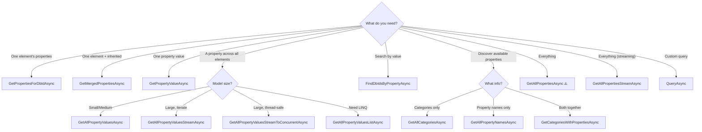

# API Reference

**Namespace:** `SVF.PropDbReader`

---

## PropDbReader Class

Implements: `IDisposable`

The main class for reading and querying the SVF property database.

### Constructor

| Constructor | Description |
|---|---|
| `PropDbReader(string dbPath, bool deleteDbOnDispose = false)` | Opens a local `.sdb` file. Set `deleteDbOnDispose` to `true` to auto-clean the file when disposed. |

### Static Factory Methods

| Method | Returns | Description |
|---|---|---|
| `CreateAsync(string accessToken, string urn, CancellationToken)` | `Task<PropDbReader>` | **Recommended.** Asynchronously downloads the DB from APS and returns a ready-to-use reader. Auto-deletes on dispose. |
| `DownloadAndGetPathAsync(string accessToken, string urn, CancellationToken)` | `Task<string>` | Downloads the DB and returns the local file path without opening a reader. |

### Instance Methods

#### Method Selection Guide

#### Single Element Queries

| Method | Returns | Description |
|---|---|---|
| `GetPropertiesForDbIdAsync(long dbId, CancellationToken)` | `Task<Dictionary<string, object?>>` | Gets all **direct** properties for a specific element. Keys are `"{category}_{displayName}"`. |
| `GetMergedPropertiesAsync(long dbId, CancellationToken)` | `Task<Dictionary<string, object?>>` | Gets all properties for an element, **including inherited properties** from parent elements (recursively). |
| `GetPropertyValueAsync(long dbId, string category, string displayName, CancellationToken)` | `Task<object?>` | Gets the value of a **single specific property** by category and display name. |
| `GetParentDbIdAsync(long dbId, CancellationToken)` | `Task<long?>` | Returns the parent element's `dbId`, or `null` if there is no parent. |

#### Bulk Property Queries

| Method | Returns | Description |
|---|---|---|
| `GetAllPropertyValuesAsync(string category, string displayName, CancellationToken)` | `Task<Dictionary<long, object?>>` | Gets a specific property **across all elements** as `Dictionary<dbId, value>`. ⚠️ High memory for large models. |
| `GetAllPropertyValuesStreamAsync(string category, string displayName, CancellationToken)` | `IAsyncEnumerable<(long, object?)>` | **Streams** a specific property across all elements. Memory-efficient. |
| `GetAllPropertyValuesListAsync(string category, string displayName, CancellationToken)` | `Task<List<(long, object?)>>` | Flat list of tuples. Useful for LINQ and parallel processing. |
| `GetAllPropertyValuesConcurrentAsync(string category, string displayName, CancellationToken)` | `Task<ConcurrentDictionary<long, object?>>` | Thread-safe `ConcurrentDictionary` result. |
| `GetAllPropertyValuesStreamToConcurrentAsync(string category, string displayName, ConcurrentDictionary dict, CancellationToken)` | `Task` | Streams into a provided `ConcurrentDictionary`. Combines memory efficiency with thread safety. |

#### Full Database Queries

| Method | Returns | Description |
|---|---|---|
| `GetAllPropertiesAsync(CancellationToken)` | `Task<Dictionary<long, Dictionary<string, object?>>>` | All properties for all elements. ⚠️ Very high memory for large models. |
| `GetAllPropertiesStreamAsync(CancellationToken)` | `IAsyncEnumerable<(long, string, object?)>` | **New in v1.1.0.** Streams all properties as `(dbId, key, value)` tuples. Memory-efficient alternative to `GetAllPropertiesAsync`. |
| `FindDbIdsByPropertyAsync(string category, string displayName, object value, CancellationToken)` | `Task<List<long>>` | Finds all `dbId`s that have a specific property matching a given value. |
| `QueryAsync(string sql, Dictionary<string, object?>? parameters, CancellationToken)` | `Task<List<Dictionary<string, object?>>>` | Executes a **custom SQL query** with optional parameters. Returns rows as dictionaries. |

#### Schema Discovery

| Method | Returns | Description |
|---|---|---|
| `GetAllCategoriesAsync(CancellationToken)` | `Task<List<string>>` | All distinct category names, sorted. |
| `GetAllPropertyNamesAsync(CancellationToken)` | `Task<List<string>>` | All distinct property display names, sorted. |
| `GetCategoriesWithPropertiesAsync(CancellationToken)` | `Task<Dictionary<string, List<string>>>` | Map of each category to its list of property display names. |

#### Lifecycle

| Method | Returns | Description |
|---|---|---|
| `DeleteDbFile()` | `bool` | Deletes the underlying `.sdb` file. Returns `true` if deleted. |
| `Dispose()` | `void` | Closes connection and frees resources. Deletes file if `deleteDbOnDispose` was set. |

### Memory Usage Guide

| Method | Memory | When to Use |
|---|---|---|
| `GetPropertyValueAsync` | **Minimal** | Single value lookup |
| `GetPropertiesForDbIdAsync` | **Low** | One element at a time |
| `GetAllCategoriesAsync` | **Low** | Discover schema categories |
| `GetAllPropertyNamesAsync` | **Low** | Discover property names |
| `GetCategoriesWithPropertiesAsync` | **Low** | Full schema tree |
| `GetAllPropertyValuesStreamAsync` | **Low** | Iterate all values, large models |
| `GetAllPropertiesStreamAsync` | **Low** | Stream all properties, large models |
| `GetAllPropertyValuesStreamToConcurrentAsync` | **Low** | Thread-safe + streaming |
| `GetAllPropertyValuesListAsync` | **Medium** | Need LINQ or parallel processing |
| `GetAllPropertyValuesAsync` | **Medium–High** | Dictionary access by dbId |
| `GetAllPropertyValuesConcurrentAsync` | **Medium–High** | Thread-safe dictionary access |
| `GetAllPropertiesAsync` | **Very High** | Full database dump |

---

## DbDownloader Class

**Namespace:** `SVF.PropDbReader`  
**Implements:** `IDisposable`

Handles downloading the property database from APS Model Derivative service.

| Constructor | Description |
|---|---|
| `DbDownloader(string accessToken, string region = "US")` | Creates a downloader with the given APS access token and region. |

| Method | Returns | Description |
|---|---|---|
| `DownloadPropertiesDatabaseAsync(string urn, CancellationToken)` | `Task<string?>` | Downloads the property database for the given model URN. Returns the local file path, or `null` if derivative not found. Files are cached in system temp directory. |
| `SanitizeFilename(string urn)` | `string` | (internal) Converts a URN to a safe filename. |

---

## ManifestHelper Class

**Namespace:** `SVF.PropDbReader`

A utility for traversing the APS model derivative manifest tree.

| Constructor | Description |
|---|---|
| `ManifestHelper(Manifest manifest)` | Wraps an Autodesk `Manifest` object. |

| Method | Returns | Description |
|---|---|---|
| `Search(string? guid, string? type, string? role)` | `List<ManifestResources>` | Finds derivatives matching any combination of criteria. Pass `null` to skip a filter. |
| `Traverse(Func<ManifestResources, bool> callback)` | `void` | Walks every node in the manifest tree. Return `true` to recurse deeper; `false` to skip children. |

---

## Models & Data Types

### Property Keys

Keys returned by `GetPropertiesForDbIdAsync` and `GetMergedPropertiesAsync` follow the format: `{Category}_{DisplayName}`

| Category | Example Properties | Description |
|---|---|---|
| `__name__` | (empty display name) | The element's display name |
| `__category__` | (empty display name) | The Revit category (Walls, Floors, etc.) |
| `__parent__` | (empty display name) | Parent element's dbId (long) |
| `__instanceof__` | (empty display name) | Type element dbId this instance references |
| `Identity Data` | `Name`, `Type Name`, `Type Id` | Identification parameters |
| `Dimensions` | `Width`, `Height`, `Length`, `Area`, `Volume` | Geometric measurements |
| `Constraints` | `Base Constraint`, `Top Constraint`, `Base Offset` | Element constraints |
| `Materials and Finishes` | `Structural Material`, `Material` | Material assignments |

> **Tip:** Use `GetAllCategoriesAsync()` and `GetCategoriesWithPropertiesAsync()` to discover the actual categories/properties available in your model.

### Value Types

| .NET Type | When | Example |
|---|---|---|
| `string` | Text values | `"Basic Wall"` |
| `long` | Integer values, dbId references | `42` |
| `double` | Floating point measurements | `3.14159` |
| `null` | Property exists but has no value | `null` |
