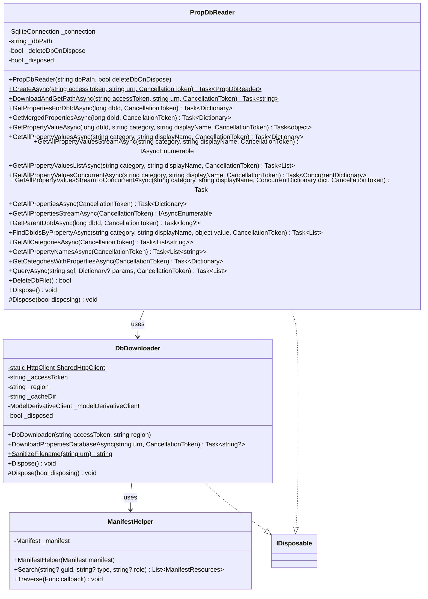
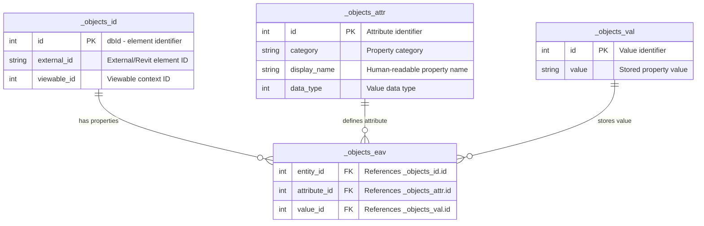
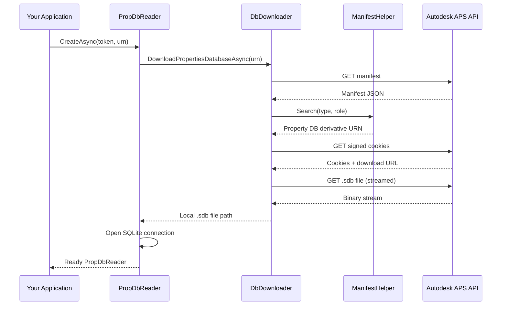
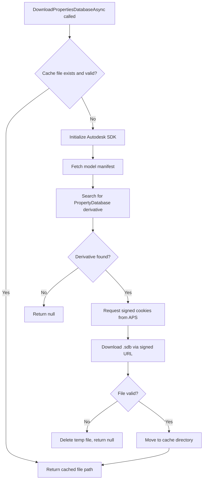
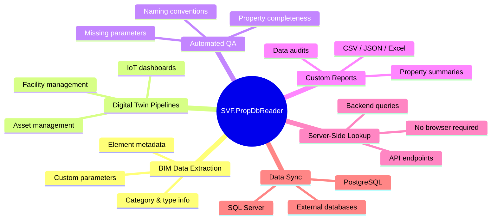

# Architecture

## Class Diagram

---

## Database Schema (EAV Model)

The property database uses an **Entity-Attribute-Value (EAV)** schema:

**Key concept:** The `dbId` is the numeric identifier for every element in the model. It corresponds to the same dbId used in the APS Viewer JavaScript API.

---

## Data Flow — Downloading from APS

---

## Download Caching Flow

---

## Thread Safety Design

In v1.1.0, the library was redesigned for improved safety:

- **No shared mutable state** — Each query method creates its own `SqliteCommand`, eliminating the previous thread-safety issue with shared commands.
- **Proper `Dispose(bool)`** — Both `PropDbReader` and `DbDownloader` implement the canonical dispose pattern with idempotency guards.
- **Static `HttpClient`** — `DbDownloader` uses a shared static `HttpClient` to prevent socket exhaustion.
- **`ConfigureAwait(false)`** — All async methods use `ConfigureAwait(false)` to avoid deadlocks when consumed from UI or ASP.NET synchronization contexts.

---

## Use Cases

